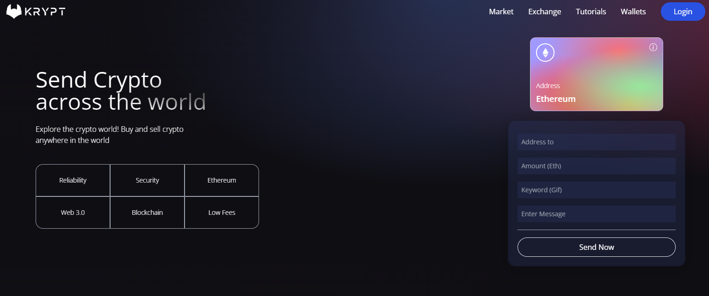

<h1 align="center">
  <br>
  KryptoPay
  <br>
</h1>

<p align="center">
  <strong>A Web Application for Secure Ethereum Transfers between Metamask Wallets</strong>
</p>

<p align="center">
  
</p>

## Table of Contents

- [About](#about)
- [Features](#features)
- [Getting Started](#getting-started)
- [Usage](#usage)
- [Technologies](#technologies)

## About

KryptoPay is a user-friendly web application built to facilitate Ethereum transfers between Metamask wallets. With a sleek UI and robust backend, users can quickly and securely send Ethereum to other Metamask addresses while adding a personalized message.

## Features

- **Secure Wallet Connection:**
  - Connect your Metamask wallet to the KryptoPay app for seamless transfers.
  
- **Easy Transfer Process:**
  - Choose the recipient's wallet address.
  - Enter the amount of Ethereum you want to send.
  - Add an optional message to personalize the transaction.
  
- **Real-time Status Updates:**
  - Track the transaction's progress in real-time.
  - A celebratory GIF appears once the transfer is successfully completed.

## Getting Started

To start using KryptoPay, follow these simple steps:

1. **Clone the Repository:**
   ```bash
   git clone https://github.com/Pankajjsuthar/KryptoPay.git
   cd KryptoPay

2. **Install Dependencies**
   ```
   npm install
   ```
4. **Run the application
   ```
   cd client
   npm run dev

   cd smart_contract
   npx hardhat run scripts/deploy.js --network sepolia
   ```
   This command line will give you Transactions address: 0x................Cf copy and paste it in client/src/utils/constants in contractAddress

## Usage

Connect Wallet:

Click the "Connect Wallet" button to link your Metamask wallet.
Initiate Transfer:

Select the recipient's wallet address.
Enter the amount of Ethereum you want to send.
Add an optional message.
Monitor Progress:

Keep an eye on the transaction status as it progresses.
Completion Celebration:

A celebratory GIF appears once the transfer is successfully completed.


## Technologies
#*Frontend:*

ReactJS for building the user interface.
CSS for styling the app.

#*Backend:*

Solidity for smart contract development.
JavaScript for backend scripting.

#*Blockchain Integration:*

Metamask for wallet connectivity.
Sepolia Faucet Network for obtaining test Ethereum.
